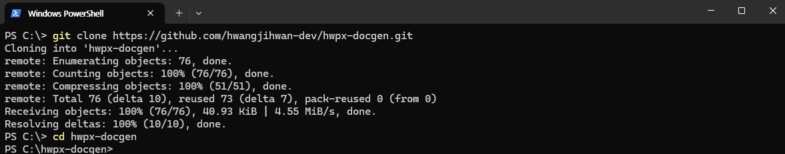
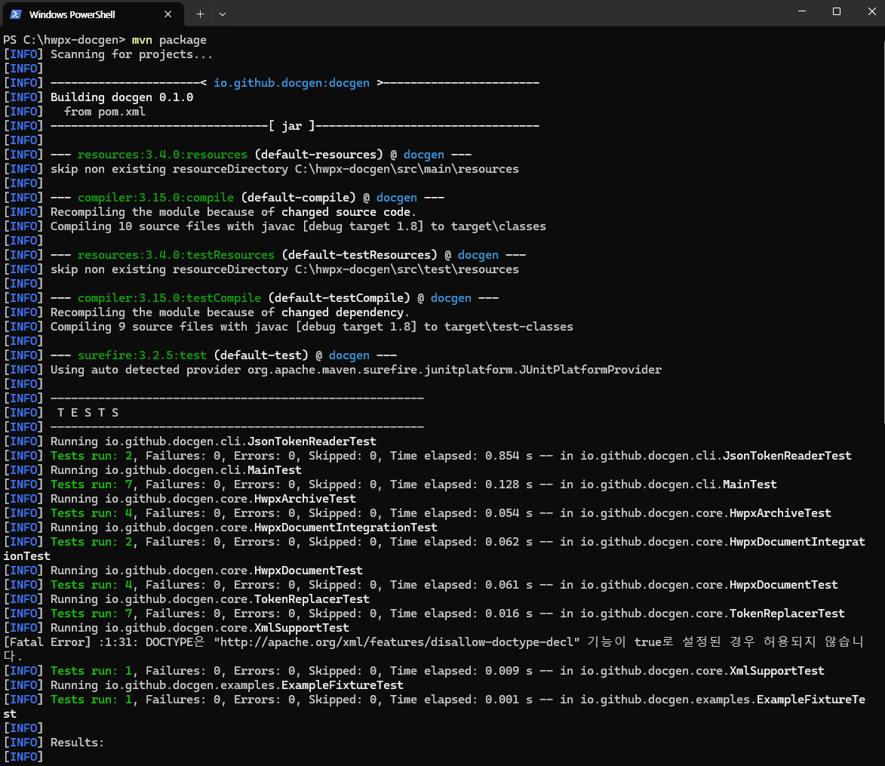
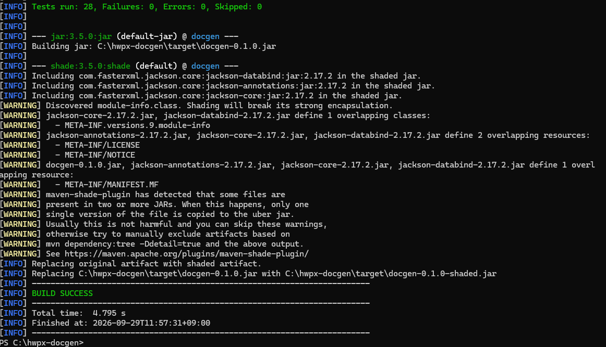
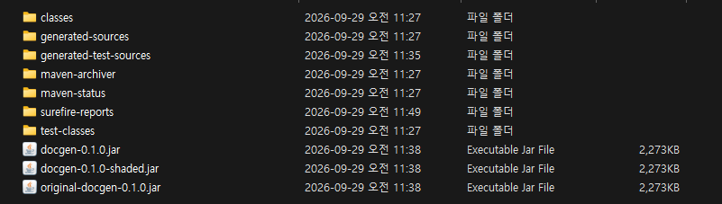
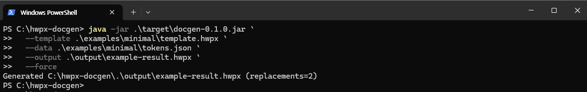
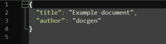
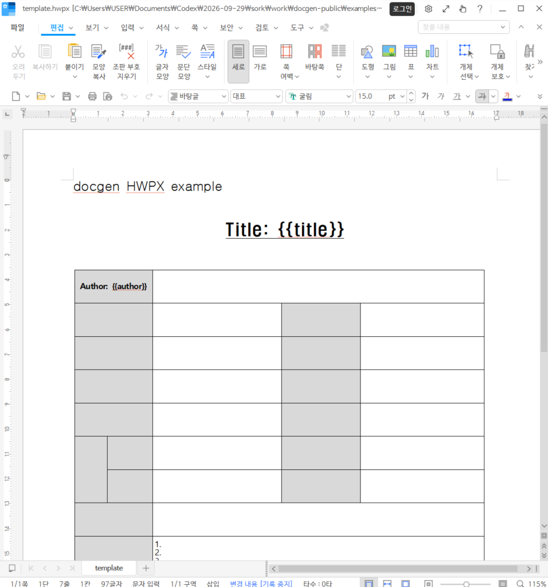
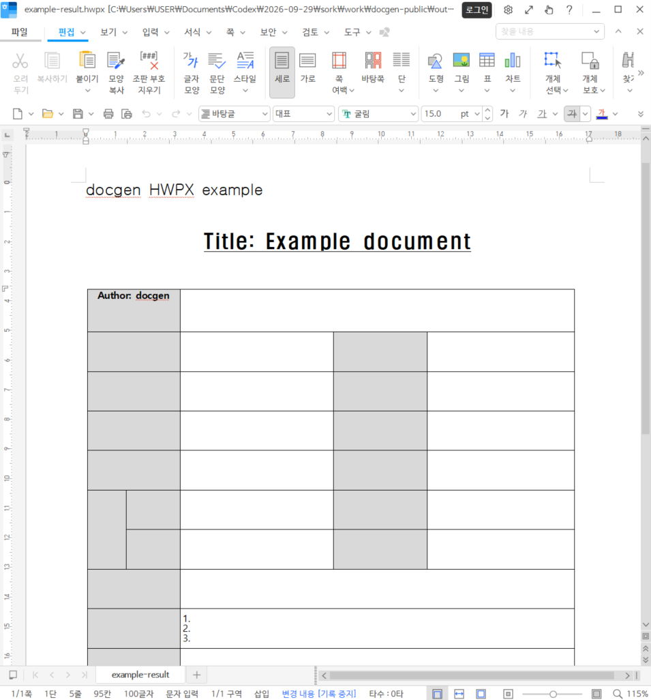

# HWPX Docgen

한/글을 직접 열지 않고 HWPX 템플릿과 JSON 데이터를 이용해 반복 문서를 자동 생성하는 Java CLI 및 라이브러리입니다.

문서 양식은 HWPX 템플릿으로 관리하고, 실제 데이터는 JSON으로 분리합니다.

```text
template.hwpx + tokens.json
              ↓
          docgen
              ↓
       generated.hwpx
```

문서 한 건을 수동으로 수정하는 경우보다, 같은 양식의 보고서·회의록·안내문·결과서를 반복 생성하거나 스크립트와 스케줄러에 연결할 때 유용합니다.

주간보고 자동화 프로젝트와는 별개의 독립 프로젝트입니다. 공개 저장소에는 재사용 가능한 문서 생성 핵심 코드, 테스트, 그리고 민감정보를 제거한 최소 예제만 포함합니다.

## 주요 기능

- HWPX ZIP 압축 파일 읽기 및 생성
- `Contents/section*.xml` 파일의 `{{title}}`, `{{author}}` 같은 토큰 치환
- 여러 HWPX 텍스트 런으로 나뉜 플레이스홀더 처리
- 기본적으로 누락 토큰을 오류로 처리하고, `--allow-missing`으로 미치환 상태 허용
- `--force` 없이는 기존 출력 파일을 덮어쓰지 않음
- ZIP Slip 공격 및 XML 외부 엔티티 확장을 방어
- Java API와 실행 가능한 명령줄 JAR 제공

## 요구 사항

- 실행: Java 8 이상
- 빌드: Maven 3.8 이상

설치 여부는 다음 명령으로 확인할 수 있습니다.

```powershell
java -version
mvn -version
```

`mvn`을 찾을 수 없다는 메시지가 나오면 Maven을 설치하고 `PATH`를 설정한 뒤 새 PowerShell 창을 열어 다시 확인하세요. Maven 설치 방법은 [Maven 공식 설치 안내](https://maven.apache.org/install.html)를 참고하세요.

## 5분 만에 실행하기

아래 캡처는 Windows PowerShell과 한/글 기준입니다. macOS, Linux, Git Bash에서는 명령줄 형식이 조금 다를 수 있습니다.

### 1. 저장소 받기

PowerShell에서 작업할 폴더로 이동한 다음 저장소를 복제합니다.

```powershell
git clone https://github.com/hwangjihwan-dev/hwpx-docgen.git
cd hwpx-docgen
```



이미 복제한 저장소라면 다음처럼 최신 문서를 받을 수 있습니다.

```powershell
cd C:\path\to\hwpx-docgen
git pull origin main
```

### 2. 빌드하기

프로젝트 루트(`pom.xml`이 있는 폴더)에서 실행합니다.

```powershell
mvn package
```







성공하면 실행 가능한 JAR가 `target/docgen-0.1.0.jar`에 생성됩니다.

### 3. 최소 예제 실행하기

PowerShell에서는 줄 끝에 백틱(역따옴표)을 사용합니다.

```powershell
java -jar .\target\docgen-0.1.0.jar `
  --template .\examples\minimal\template.hwpx `
  --data .\examples\minimal\tokens.json `
  --output .\output\example-result.hwpx `
  --force
```



다음과 같은 메시지가 나오면 성공입니다.

```text
Generated ...\output\example-result.hwpx (replacements=2)
```







생성된 `output\example-result.hwpx`를 한/글에서 열어 결과를 확인하세요. 출력 파일이 이미 있으면 `--force`를 사용해야 덮어쓸 수 있습니다.

macOS, Linux 또는 Git Bash에서는 다음처럼 실행할 수 있습니다.

```bash
java -jar ./target/docgen-0.1.0.jar \
  --template ./examples/minimal/template.hwpx \
  --data ./examples/minimal/tokens.json \
  --output ./output/example-result.hwpx \
  --force
```

## 빌드

```bash
mvn test
mvn package
```

실행 가능한 JAR는 `target/docgen-0.1.0.jar`에 생성됩니다.

## 내 템플릿 사용하기

### 1. HWPX 템플릿 만들기

한/글에서 문서를 만든 뒤 값이 들어갈 위치에 다음 형식의 토큰을 입력합니다.

```text
제목: {{title}}
작성자: {{author}}
```

토큰 이름에는 영문자, 숫자, `_`, `-`, `.`를 사용할 수 있습니다. 예를 들어 `{{report.title}}`, `{{user_name}}`, `{{item-1}}`은 사용할 수 있지만 한글 토큰 이름은 사용할 수 없습니다.

문서를 HWPX 형식으로 저장한 뒤 템플릿 경로로 사용합니다. 기존 업무 문서를 그대로 공개 저장소에 올리지 말고, 개인정보와 내부 정보가 제거된 별도 템플릿을 사용하세요.

### 2. JSON 데이터 만들기

JSON은 토큰 이름과 치환할 문자열을 연결한 평면 객체여야 합니다.

```json
{
  "title": "2026년 9월 주간보고",
  "author": "홍길동"
}
```

배열, 중첩 객체, 숫자·불리언 값은 지원하지 않습니다. JSON의 키 이름은 HWPX 템플릿의 토큰 이름과 정확히 일치해야 합니다.

### 3. 문서 생성하기

```powershell
java -jar .\target\docgen-0.1.0.jar `
  --template .\templates\weekly-report.hwpx `
  --data .\data\weekly-report.json `
  --output .\output\weekly-report-result.hwpx `
  --force
```

기본 동작은 JSON에 없는 토큰을 오류로 처리하는 것입니다. 일부 토큰을 나중에 채울 예정이면 `--allow-missing`을 추가해 미치환 토큰을 그대로 둘 수 있습니다.

## 명령줄 사용법

```bash
```
명령줄 기본 형식은 다음과 같습니다. PowerShell에서 그대로 실행할 때는 위의 5분 실행 예제를 사용하세요.

```text
java -jar target/docgen-0.1.0.jar --template <template.hwpx> --data <tokens.json> --output <result.hwpx> [--allow-missing] [--force]
```

입력 JSON은 값이 모두 문자열인 평면 객체여야 합니다.

```json
{
  "title": "Example document",
  "author": "docgen"
}
```

| 옵션 | 설명 |
| --- | --- |
| `--template <file>` | 원본 HWPX 템플릿 |
| `--data <file>` | 평면 JSON 토큰 맵 |
| `--output <file>` | 생성할 HWPX 경로 |
| `--allow-missing` | JSON에 없는 플레이스홀더를 그대로 둠 |
| `--force` | 기존 출력 파일을 덮어씀 |
| `--help` | 사용법 출력 |

종료 코드는 다음과 같습니다. `0`은 성공, `2`는 인자 또는 입력 오류, `3`은 잘못된 HWPX/XML, `4`는 토큰 또는 JSON 검증 오류, `5`는 출력을 안전하게 쓸 수 없는 경우입니다.

## Java API

기본 생명주기는 다음과 같습니다.

```java
import java.nio.file.Path;
import java.nio.file.Paths;
import java.util.HashMap;
import java.util.Map;

import io.github.docgen.core.HwpxDocument;
import io.github.docgen.core.ReplacementResult;

Path templatePath = Paths.get("template.hwpx");
Path outputPath = Paths.get("result.hwpx");

Map<String, String> tokens = new HashMap<>();
tokens.put("title", "Example document");
tokens.put("author", "docgen");

HwpxDocument document = HwpxDocument.open(templatePath);
try {
    ReplacementResult result = document.replaceTokens(tokens, false);
    document.write(outputPath, false);
} finally {
    document.close();
}
```

위 예제의 `templatePath`와 `outputPath`는 `Path` 객체여야 합니다. 예를 들면 `Paths.get("template.hwpx")`처럼 만들 수 있습니다.

토큰 이름에는 영문자, 숫자, `_`, `-`, `.`를 사용할 수 있습니다. 토큰 값은 문자열이어야 합니다. 이 라이브러리는 HWPX의 섹션 XML 파일을 직접 처리하므로 템플릿을 만든 별도 애플리케이션에 의존하지 않습니다.

## 예제

한/글에서 열 수 있는 최소 HWPX 패키지 예제와 토큰 데이터는 [`examples/minimal`](examples/minimal)에서 확인할 수 있습니다. `docgen`의 기본 처리 흐름을 확인하기 위한 예제이며, 실제 업무용 문서 템플릿 전체를 제공하는 것은 아닙니다.

처음 실행할 때는 [`examples/minimal/README.md`](examples/minimal/README.md)의 명령을 그대로 따라 하세요.

## 활용 예제

`docgen`은 문서 하나의 값을 바꾸는 도구라기보다, 같은 HWPX 양식으로 여러 문서를 반복 생성할 때 유용합니다.

| 상황 | 시작점 |
| --- | --- |
| 문서 한 건을 생성하고 동작을 확인 | [`examples/minimal`](examples/minimal) |
| 여러 JSON 파일에서 문서를 일괄 생성 | [`examples/batch-reports`](examples/batch-reports) |
| 업무 시스템·스크립트·스케줄러에서 호출 | 아래 명령줄 실행 예제와 일괄 생성 스크립트 조합 |

### 여러 문서 일괄 생성

템플릿 하나와 데이터 JSON 여러 개를 준비하면 사람별·부서별·기간별 HWPX 파일을 반복 생성할 수 있습니다.

```text
templates/report.hwpx
data/team-a.json
data/team-b.json
data/team-c.json
          ↓
output/team-a.hwpx
output/team-b.hwpx
output/team-c.hwpx
```

실행 가능한 PowerShell 스크립트는 [`examples/batch-reports`](examples/batch-reports)에 있습니다.

```powershell
.\examples\batch-reports\generate.ps1
```

이 예제는 별도의 주간보고 프로젝트에 의존하지 않습니다. 같은 방식으로 보고서, 회의록, 안내문, 결과서 등 각 프로젝트의 HWPX 템플릿을 연결할 수 있습니다.

### 자동화 시스템과 연결

외부 시스템에서 JSON 파일을 만든 다음 `docgen`을 명령줄로 호출하면 됩니다.

```powershell
java -jar .\target\docgen-0.1.0.jar `
  --template .\templates\report.hwpx `
  --data .\data\report.json `
  --output .\output\report.hwpx `
  --force
```

따라서 PowerShell, Python, Java 애플리케이션, 작업 스케줄러, CI 작업 등에서 같은 생성 절차를 재사용할 수 있습니다.

## 문제 해결

### `mvn`을 찾을 수 없음

Java는 설치되어 있어도 Maven은 별도로 설치해야 합니다. Maven 설치 후 새 터미널을 열고 `mvn -version`이 동작하는지 확인하세요.

### `pom.xml`을 찾을 수 없음

명령을 프로젝트 루트에서 실행해야 합니다. `dir pom.xml`로 현재 폴더에 `pom.xml`이 있는지 확인하세요.

### 출력 파일이 이미 존재함

기존 파일을 보존하기 위해 기본적으로 덮어쓰지 않습니다. 새 파일을 만들거나 명령에 `--force`를 추가하세요.

### 토큰이 치환되지 않음

JSON 키와 HWPX 토큰 이름이 정확히 일치하는지 확인하세요. 예를 들어 `{{title}}`은 JSON에 `"title"` 키가 있어야 치환됩니다.

### 한/글에서 문서가 손상되었다고 표시됨

템플릿은 한/글에서 정상적으로 열리고 HWPX 형식으로 저장된 파일이어야 합니다. 공개 저장소의 최소 예제로 먼저 동작을 확인한 뒤, 업무용 템플릿을 하나씩 추가하세요. 문서 보안 설정을 낮추는 방식으로 해결하지 마세요.

## 보안 참고 사항

템플릿은 신뢰할 수 없는 입력으로 취급합니다. 압축 해제 시 대상 디렉터리 밖으로 벗어나는 ZIP 엔트리는 거부합니다. XML 파싱에서는 DTD, 외부 엔티티, 외부 스키마, XInclude를 비활성화합니다. 생성 결과는 임시 압축 파일을 거쳐 기록하며, 기본적으로 기존 파일을 덮어쓰지 않습니다.

## 라이선스

이 프로젝트는 Apache License 2.0으로 배포합니다. 자세한 내용은 [`LICENSE`](LICENSE)와 [`THIRD-PARTY-NOTICES`](THIRD-PARTY-NOTICES)를 확인하세요.
